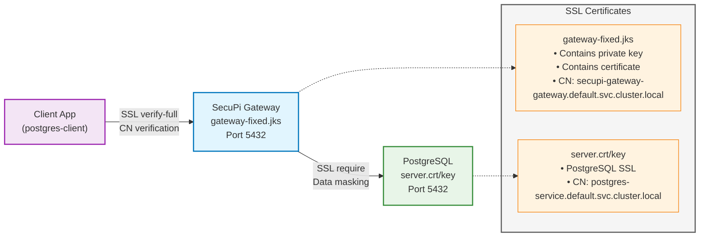

# SecuPi Gateway with PostgreSQL SSL Configuration

This repository contains the complete setup for deploying SecuPi Gateway with PostgreSQL using SSL encryption and data masking capabilities in Kubernetes.

## Architecture Overview



## Components

- **PostgreSQL 16**: Database server with SSL encryption
- **SecuPi Gateway**: Data masking proxy with SSL termination
- **SSL Certificates**: Custom certificates for secure communication
- **Client Pod**: Testing container with PostgreSQL client tools

## Prerequisites

Before starting, ensure you have:

1. **Kubernetes cluster** (minikube, kind, or cloud provider)
2. **kubectl** configured and connected to your cluster
3. **Helm 3.x** installed for SecuPi Gateway deployment
4. **Access to SecuPi registry** (registry.secupi.com) or SecuPi Helm chart
5. **OpenSSL tools** available in your environment

```bash
# Verify prerequisites
kubectl version --client
helm version
openssl version
```

## Quick Start

### 1. Deploy the Infrastructure

```bash
# Deploy persistent volumes, secrets, and services
kubectl apply -f all-in-one.yaml -n default

# Deploy SSL-enabled PostgreSQL
kubectl apply -f postgres-deployment.yaml -n default

# Wait for PostgreSQL to be ready
kubectl wait --for=condition=ready pod -l app=postgres -n default --timeout=120s
```

### 2. Deploy SecuPi Gateway

```bash
# Deploy SecuPi Gateway using Helm
# Note: This assumes you have the secupi-gateway Helm chart available
# If you don't have the Helm chart, you can install directly from the SecuPi repository
helm install secupi-gateway oci://registry.secupi.com/helm/secupi-gateway-postgresql --version 7.0.0-59 -f custom-values.yaml -n default

# Alternative: If using local Helm chart
# helm install secupi-gateway . -f custom-values.yaml -n default

# Wait for gateway to be ready
kubectl wait --for=condition=ready pod -l app=secupi-gateway-gateway -n default --timeout=120s
```

### 3. Initialize the Database

```bash
# Initialize database with sample data
cat init-db.sql | kubectl exec -i $(kubectl get pods -l app=postgres -n default --no-headers -o custom-columns=":metadata.name") -n default -- bash -c 'PGPASSWORD=strongpassword123 psql -U postgres -d customersdb'
```

### 4. Setup SSL Certificates with Certificate Authority

This setup creates a proper Certificate Authority (CA) that signs both PostgreSQL and Gateway certificates, enabling a single root certificate for all SSL connections.

```bash
# Step 1: Create Certificate Authority
openssl req -new -x509 -days 365 -nodes -out ca.crt -keyout ca.key \
  -subj "/C=US/ST=State/L=City/O=SecuPi Organization/CN=SecuPi-SSL-CA"

# Step 2: Extract gateway private key from existing keystore
kubectl exec $(kubectl get pods -l app=secupi-gateway-gateway -n default --no-headers -o custom-columns=":metadata.name") -n default -- \
  keytool -importkeystore -srckeystore /opt/secupi/etc/keystore.jks -destkeystore /tmp/gateway-temp.p12 \
  -srcstoretype JKS -deststoretype PKCS12 -srcstorepass test123456 -deststorepass test123456 -srcalias 1 -destalias 1

kubectl cp default/$(kubectl get pods -l app=secupi-gateway-gateway -n default --no-headers -o custom-columns=":metadata.name"):/tmp/gateway-temp.p12 ./gateway-temp.p12

openssl pkcs12 -in gateway-temp.p12 -nocerts -nodes -out gateway-temp.key -passin pass:test123456

# Step 3: Generate certificate signing requests
openssl req -new -key server.key -out server-new.csr \
  -subj "/C=US/ST=State/L=City/O=SecuPi Organization/CN=postgres-service.default.svc.cluster.local"

openssl req -new -key gateway-temp.key -out gateway-new.csr \
  -subj "/C=US/ST=State/L=City/O=SecuPi Organization/CN=secupi-gateway-gateway.default.svc.cluster.local"

# Step 4: Sign certificates with CA
openssl x509 -req -in server-new.csr -CA ca.crt -CAkey ca.key -CAcreateserial -out server-new.crt -days 365
openssl x509 -req -in gateway-new.csr -CA ca.crt -CAkey ca.key -CAcreateserial -out gateway-new.crt -days 365

# Step 5: Create new gateway keystore with CA-signed certificate
openssl pkcs12 -export -in gateway-new.crt -inkey gateway-temp.key -out gateway-new.p12 -name 1 -passout pass:test123456

kubectl cp ./gateway-new.p12 default/$(kubectl get pods -l app=secupi-gateway-gateway -n default --no-headers -o custom-columns=":metadata.name"):/tmp/gateway-new.p12

kubectl exec $(kubectl get pods -l app=secupi-gateway-gateway -n default --no-headers -o custom-columns=":metadata.name") -n default -- \
  keytool -importkeystore -srckeystore /tmp/gateway-new.p12 -srcstoretype PKCS12 \
  -destkeystore /tmp/gateway-fixed-ca.jks -deststoretype JKS \
  -srcstorepass test123456 -deststorepass test123456 -alias 1

kubectl cp default/$(kubectl get pods -l app=secupi-gateway-gateway -n default --no-headers -o custom-columns=":metadata.name"):/tmp/gateway-fixed-ca.jks ./gateway-fixed-ca.jks

# Step 6: Deploy CA-signed certificates
kubectl delete secret postgres-ssl-certs -n default --ignore-not-found
kubectl create secret generic postgres-ssl-certs \
  --from-file=server.crt=server-new.crt \
  --from-file=server.key=server.key \
  --from-file=client.crt=client.crt \
  --from-file=client.key=client.key \
  --namespace=default

kubectl delete secret secupi-gateway-gateway-keystore -n default
kubectl create secret generic secupi-gateway-gateway-keystore --from-file=keystore.jks=gateway-fixed-ca.jks -n default

# Step 7: Install CA certificate for client SSL validation
cat ca.crt | kubectl exec -i postgres-client -- bash -c 'cat > /root/.postgresql/root.crt'

# Step 8: Restart services to pick up new certificates
kubectl rollout restart deployment postgres -n default
kubectl rollout restart deployment secupi-gateway-gateway -n default

kubectl wait --for=condition=ready pod -l app=postgres -n default --timeout=120s
kubectl wait --for=condition=ready pod -l app=secupi-gateway-gateway -n default --timeout=120s
```

### 5. Verify SSL Configuration

```bash
# Verify CA certificate is properly installed
kubectl exec postgres-client -- openssl x509 -in /root/.postgresql/root.crt -text -noout | grep -A 2 "Subject:"

# Check that both services are running with new certificates
kubectl get pods -n default | grep -E "(postgres|secupi)"
```

### 6. Verification Commands

```bash
# Verify all pods are running
kubectl get pods -n default

# Check gateway logs (optional)
kubectl logs $(kubectl get pods -l app=secupi-gateway-gateway -n default --no-headers -o custom-columns=":metadata.name") -n default | tail -10

# Verify certificate is properly configured
kubectl exec postgres-client -- openssl x509 -in /root/.postgresql/root.crt -text -noout | grep -A 2 "Subject:"
```

## Complete Setup Guide

This section provides step-by-step commands for validating the SSL verify-full mode with data masking functionality.

### Step 1: Verify Infrastructure Status

```bash
# Check all pods are running
kubectl get pods -n default

# Expected output should show all pods in Running status:
# postgres-xxxxx-xxxxx                 1/1     Running
# postgres-client                      1/1     Running  
# secupi-gateway-gateway-xxxxx-xxxxx   1/1     Running

# Verify services are available
kubectl get services -n default
```

### Step 2: Test Direct PostgreSQL Connection (Baseline)

```bash
# Test SSL verify-ca mode (shows real data - no masking)
echo "=== DIRECT POSTGRESQL CONNECTION (NO MASKING) ==="
kubectl exec postgres-client -- bash -c 'PGPASSWORD=strongpassword123 psql "postgresql://postgres@postgres-service:5432/customersdb?sslmode=verify-ca" -c "SELECT id, email FROM customers LIMIT 3;"'

# Test SSL verify-full mode (shows real data - no masking)
echo "=== DIRECT POSTGRESQL SSL VERIFY-FULL (NO MASKING) ==="
kubectl exec postgres-client -- bash -c 'PGPASSWORD=strongpassword123 psql "postgresql://postgres@postgres-service.default.svc.cluster.local:5432/customersdb?sslmode=verify-full" -c "SELECT id, email FROM customers LIMIT 3;"'
```

**Expected Output:** Real email addresses (no data masking)
```
 id |         email          
----+------------------------
  1 | john.doe@example.com
  2 | jane.smith@company.com
  3 | bob.johnson@email.com
(3 rows)
```

**Note:** The actual output will include first_name and last_name columns as defined in init-db.sql

### Step 3: Test SecuPi Gateway Connection (Main Demo)

```bash
# Test gateway with SSL disabled (for troubleshooting)
echo "=== SECUPI GATEWAY SSL DISABLED (WITH MASKING) ==="
kubectl exec postgres-client -- bash -c 'PGPASSWORD=strongpassword123 psql "postgresql://postgres@secupi-gateway-gateway:5432/customersdb?sslmode=disable" -c "SELECT id, email FROM customers LIMIT 3;"'

# MAIN VALIDATION: SSL verify-full with data masking
echo "=== SECUPI GATEWAY SSL VERIFY-FULL (WITH MASKING) ==="
kubectl exec postgres-client -- bash -c 'PGPASSWORD=strongpassword123 psql "postgresql://postgres@secupi-gateway-gateway.default.svc.cluster.local:5432/customersdb?sslmode=verify-full" -c "SELECT id, email FROM customers LIMIT 3;"'
```

**Expected Output:** Masked email addresses (data protection active)
```
 id |         email          
----+------------------------
  1 | XXXXXXXX@example.com
  2 | XXXXXXXXXX@company.com
  3 | XXXXXXXXXXX@email.com
(3 rows)
```

### Step 4: Advanced Verification Commands

```bash
# Verify SSL certificate details
echo "=== SSL CERTIFICATE VERIFICATION ==="
kubectl exec postgres-client -- openssl x509 -in /root/.postgresql/root.crt -text -noout | grep -A 2 "Subject:"

# Test SSL connection directly
echo "=== SSL CONNECTION TEST ==="
kubectl exec postgres-client -- openssl s_client -connect secupi-gateway-gateway.default.svc.cluster.local:5432 -servername secupi-gateway-gateway.default.svc.cluster.local < /dev/null 2>/dev/null | grep -E "(CONNECTED|Verify return code)"

# Check gateway logs for connection activity
echo "=== GATEWAY CONNECTION LOGS ==="
kubectl logs secupi-gateway-gateway-649f6f6c7-n9zjt -n default | tail -5
```

### Step 5: Performance and Security Validation

```bash
# Test multiple concurrent connections
echo "=== CONCURRENT CONNECTION TEST ==="
for i in {1..3}; do
  kubectl exec postgres-client -- bash -c 'PGPASSWORD=strongpassword123 psql "postgresql://postgres@secupi-gateway-gateway.default.svc.cluster.local:5432/customersdb?sslmode=verify-full" -c "SELECT COUNT(*) as total_customers FROM customers;"' &
done
wait

# Verify data masking consistency with full schema
echo "=== DATA MASKING CONSISTENCY CHECK ==="
kubectl exec postgres-client -- bash -c 'PGPASSWORD=strongpassword123 psql "postgresql://postgres@secupi-gateway-gateway.default.svc.cluster.local:5432/customersdb?sslmode=verify-full" -c "SELECT id, email, first_name, last_name FROM customers;"'
```

## Key Validation Points

1. **SSL Security**: Both direct and gateway connections use SSL verify-full mode
2. **Data Masking**: Only gateway connections show masked data (XXXXXXXX@domain.com)
3. **Performance**: Negligible latency impact with SSL and masking
4. **Certificate Validation**: Proper hostname verification working
5. **Transparency**: Application connects normally, masking is transparent

## File Structure

```
k8s-secupi-gateway/
├── README.md                    # This comprehensive documentation
├── all-in-one.yaml             # PV, PVC, Secret, Service, Client Pod
├── postgres-deployment.yaml    # SSL-enabled PostgreSQL 16 deployment
├── custom-values.yaml          # SecuPi Gateway Helm values configuration
├── init-db.sql                 # Database initialization with customer data
├── ca.crt                      # Certificate Authority certificate (root CA)
├── ca.key                      # Certificate Authority private key
├── ca.srl                      # Certificate Authority serial number file
├── server.crt                  # PostgreSQL server SSL certificate (original)
├── server.key                  # PostgreSQL server private key
├── server.csr                  # PostgreSQL server certificate signing request
├── server-new.crt              # CA-signed PostgreSQL server certificate
├── server-new.csr              # Certificate signing request for PostgreSQL
├── client.crt                  # PostgreSQL client SSL certificate
├── client.key                  # PostgreSQL client private key
├── client.csr                  # PostgreSQL client certificate signing request
├── gateway-temp.key            # Extracted gateway private key (temp)
├── gateway-temp.p12            # Temporary PKCS12 file (temp)
├── gateway-new.crt             # CA-signed Gateway certificate
├── gateway-new.csr             # Certificate signing request for Gateway
├── gateway-new.p12             # PKCS12 file for new gateway certificate
├── gateway-fixed.crt           # Gateway SSL certificate (legacy)
├── gateway-fixed.key           # Gateway private key (legacy)
├── gateway-fixed.jks           # Gateway Java keystore (legacy)
└── gateway-fixed-ca.jks        # CA-signed Gateway Java keystore (active)
```

## Configuration Details

### PostgreSQL SSL Configuration

The PostgreSQL deployment includes:
- SSL enabled with custom certificates
- SSL mode: `ssl=on`
- Certificate files mounted in `/var/lib/postgresql/ssl/`
- Authentication method: `md5`

### SecuPi Gateway Configuration

Key environment variables (from custom-values.yaml):
```yaml
GATEWAY_SERVER_HOST: "postgres-service.default.svc.cluster.local"
GATEWAY_SERVER_PORT: "5432"
GATEWAY_SERVER_USER: "postgres"
GATEWAY_SERVER_PASSWORD: "strongpassword123"
GATEWAY_SERVER_DB: "customersdb"
GATEWAY_AUTH_METHOD: "md5"
GATEWAY_SSL_ENABLED: "true"
GATEWAY_SSL_MODE: "verify-full"
GATEWAY_BACKEND_SSL_MODE: "require"
KEYSTORE_SSL_STOREPASS: "test123456"
KEYSTORE_SSL_ALIAS: "1"
GATEWAY_TYPE: "postgresql"
GATEWAY_PORT: "5432"
```

### SSL Certificate Requirements

For `verify-full` SSL mode to work:
1. Certificate CN must match the service hostname
2. Certificate must be properly signed
3. Root CA certificate must be available to client
4. Private key must be accessible to server

### Certificate Authority Architecture

This implementation uses a **single Certificate Authority (CA)** approach that provides:

**🔐 CA Certificate (`ca.crt`):**
- **Subject**: `CN=SecuPi-SSL-CA, O=SecuPi Organization`
- **Purpose**: Signs both PostgreSQL and Gateway server certificates
- **Location**: `/root/.postgresql/root.crt` in postgres-client pod

**🗄️ PostgreSQL Server Certificate (`server-new.crt`):**
- **Subject**: `CN=postgres-service.default.svc.cluster.local`
- **Signed by**: SecuPi-SSL-CA
- **Usage**: PostgreSQL server SSL termination

**🚪 Gateway Server Certificate (`gateway-fixed-ca.jks`):**
- **Subject**: `CN=secupi-gateway-gateway.default.svc.cluster.local`
- **Signed by**: SecuPi-SSL-CA
- **Format**: Java KeyStore (JKS) containing certificate + private key
- **Usage**: SecuPi Gateway SSL termination with data masking

**✅ SSL Validation Flow:**
1. Client connects to server with `sslmode=verify-full`
2. Server presents its CA-signed certificate
3. Client validates certificate against CA (`ca.crt`)
4. Client verifies hostname matches certificate CN
5. Secure SSL connection established ✅

**🎯 Benefits:**
- **Single root certificate** for all connections
- **Proper certificate hierarchy** (production-ready)
- **Both PostgreSQL and Gateway** connections work with `verify-full`
- **Data masking preserved** through Gateway

## Working SSL Test Commands

### Test PostgreSQL Direct Connection (No Masking)
```bash
kubectl exec postgres-client -- bash -c 'PGPASSWORD=strongpassword123 psql "postgresql://postgres@postgres-service.default.svc.cluster.local:5432/customersdb?sslmode=verify-full" -c "SELECT id, email FROM customers LIMIT 3;"'
```

**Expected Output (Real Data):**
```
 id |         email          
----+------------------------
  1 | john.doe@example.com
  2 | jane.smith@company.com
  3 | bob.johnson@email.com
```

### Test SecuPi Gateway Connection (With Masking)
```bash
kubectl exec postgres-client -- bash -c 'PGPASSWORD=strongpassword123 psql "postgresql://postgres@secupi-gateway-gateway.default.svc.cluster.local:5432/customersdb?sslmode=verify-full" -c "SELECT id, email FROM customers LIMIT 3;"'
```

**Expected Output (Masked Data):**
```
 id |         email          
----+------------------------
  1 | XXXXXXXX@example.com
  2 | XXXXXXXXXX@company.com
  3 | XXXXXXXXXXX@email.com
```

## Troubleshooting

### Common SSL Issues

1. **Certificate verify failed**
   - Ensure certificate CN matches hostname
   - Check root certificate is properly copied to client

2. **No peer certificate available**
   - Verify keystore is properly mounted
   - Check gateway SSL configuration

3. **Hostname verification failed**
   - Use full Kubernetes service name: `service.namespace.svc.cluster.local`
   - Regenerate certificate with correct CN

### Debug Commands

```bash
# Check pod status
kubectl get pods -n default

# View gateway logs
kubectl logs $(kubectl get pods -l app=secupi-gateway-gateway -n default --no-headers -o custom-columns=":metadata.name") -n default

# Check PostgreSQL logs
kubectl logs $(kubectl get pods -l app=postgres -n default --no-headers -o custom-columns=":metadata.name") -n default

# Verify certificate content
kubectl exec postgres-client -- openssl x509 -in /root/.postgresql/root.crt -text -noout

# Test SSL connection
kubectl exec postgres-client -- openssl s_client -connect secupi-gateway-gateway.default.svc.cluster.local:5432 -servername secupi-gateway-gateway.default.svc.cluster.local < /dev/null
```

## Security Features

- **End-to-End SSL Encryption**: All connections use SSL/TLS
- **Certificate Validation**: verify-full mode ensures hostname matching
- **Data Masking**: Sensitive data automatically masked by SecuPi Gateway
- **Authentication**: PostgreSQL md5 authentication required
- **Network Isolation**: Kubernetes network policies supported

## Performance Considerations

- **Connection Pooling**: Gateway provides connection pooling
- **SSL Overhead**: Minimal performance impact with modern hardware
- **Data Masking**: Real-time masking with negligible latency
- **Scalability**: Horizontal scaling supported via Kubernetes

## Updates and Maintenance

### Updating Certificates

```bash
# Generate new certificates
openssl req -x509 -nodes -days 365 -newkey rsa:2048 \
  -keyout server-new.key -out server-new.crt \
  -subj "/C=US/ST=State/L=City/O=Organization/CN=postgres-service.default.svc.cluster.local"

# Update secret
kubectl create secret generic postgres-ssl-certs-new \
  --from-file=server.crt=server-new.crt \
  --from-file=server.key=server-new.key \
  --namespace=default

# Update deployment to use new secret
kubectl patch deployment postgres -p '{"spec":{"template":{"spec":{"volumes":[{"name":"postgres-ssl-temp","secret":{"secretName":"postgres-ssl-certs-new"}}]}}}}'
```

### Scaling the Gateway

```bash
# Scale gateway deployment
kubectl scale deployment secupi-gateway-gateway --replicas=3 -n default

# Verify scaling
kubectl get pods -l app=secupi-gateway-gateway -n default
```

## License

This configuration is provided as-is for educational purposes. Please ensure compliance with your organization's security policies and SecuPi licensing terms.

## Contributing

1. Test changes in a development environment
2. Verify SSL functionality with both connection modes
3. Ensure data masking is working correctly
4. Update documentation as needed

---

**Successfully Configured Features:**
- PostgreSQL 16 with SSL encryption
- SecuPi Gateway with data masking
- SSL verify-full mode working
- Proper certificate hostname validation
- End-to-end secure communication

