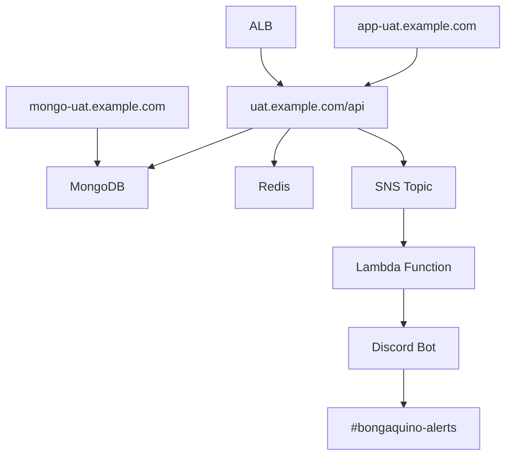

# 🔵 UAT Endpoints Documentation

## 📍 **UAT Environment URLs**

### **Primary Services**
- **Frontend (React App)**: `https://app-uat.example.com`
- **Backend API**: `https://uat.example.com/api`
- **MongoDB Admin**: `https://mongo-uat.example.com`

### **Infrastructure Endpoints**
- **ALB Main**: `bongaquino-uat-alb-630040688.ap-southeast-1.elb.amazonaws.com`
- **ECS Cluster**: `bongaquino-uat-cluster`
- **ECS Service**: `bongaquino-uat-service`

### **Monitoring & Management**
- **Discord Bot**: `🔵 bongaquino UAT Bot`
- **Discord Channel**: `#bongaquino-alerts`
- **SNS Topic**: `bongaquino-uat-discord-notifications`
- **Lambda Function**: `bongaquino-uat-discord-notifier`

## 🩺 **Health Check Endpoints**

### **Backend API Health**
```bash
curl -s https://uat.example.com/api/health | jq
```

**Expected Response:**
```json
{
  "status": "healthy",
  "environment": "uat",
  "timestamp": "2024-07-13T10:30:00.000Z",
  "services": {
    "database": "connected",
    "redis": "connected"
  }
}
```

### **Frontend Availability**
```bash
curl -I https://app-uat.example.com
```

**Expected Response:**
```
HTTP/2 200 
content-type: text/html
```

### **MongoDB Admin Interface**
```bash
curl -I https://mongo-uat.example.com
```

**Expected Response:**
```
HTTP/2 200 
content-type: text/html
```

## 🧪 **Testing Commands**

### **Send Test Discord Alert**
```bash
aws sns publish --profile bongaquino --region ap-southeast-1 \
  --topic-arn arn:aws:sns:ap-southeast-1:985869370256:bongaquino-uat-discord-notifications \
  --message "UAT system test alert" \
  --subject "UAT Test"
```

### **Monitor Lambda Logs**
```bash
aws logs tail /aws/lambda/bongaquino-uat-discord-notifier --profile bongaquino --region ap-southeast-1 --follow
```

### **Check Service Status**
```bash
# ECS Service Status
aws ecs describe-services --profile bongaquino --region ap-southeast-1 \
  --cluster bongaquino-uat-cluster \
  --services bongaquino-uat-service

# ALB Target Health
aws elbv2 describe-target-health --profile bongaquino --region ap-southeast-1 \
  --target-group-arn arn:aws:elasticloadbalancing:ap-southeast-1:985869370256:targetgroup/bongaquino-uat-targets/xxx
```

## 📊 **Service Dependencies**



## 🔍 **Troubleshooting**

### **Common Issues**

1. **Frontend Not Loading**
   ```bash
   # Check ALB health
   aws elbv2 describe-target-health --profile bongaquino
   # Check ECS service
   aws ecs describe-services --profile bongaquino --cluster bongaquino-uat-cluster
   ```

2. **API Errors**
   ```bash
   # Check backend logs
   aws logs tail /aws/ecs/bongaquino-uat --profile bongaquino --follow
   ```

3. **MongoDB Connection Issues**
   ```bash
   # Check MongoDB admin interface
   curl -v https://mongo-uat.example.com
   ```

## 📈 **Monitoring URLs**

- **CloudWatch Dashboard**: [UAT Metrics](https://console.aws.amazon.com/cloudwatch)
- **ECS Console**: [bongaquino-uat-cluster](https://console.aws.amazon.com/ecs/home?region=ap-southeast-1#/clusters/bongaquino-uat-cluster)
- **ALB Console**: [bongaquino-uat-alb](https://console.aws.amazon.com/ec2/v2/home?region=ap-southeast-1#LoadBalancers:)
- **Lambda Logs**: [bongaquino-uat-discord-notifier](https://console.aws.amazon.com/cloudwatch/home?region=ap-southeast-1#logsV2:log-groups/log-group/$252Faws$252Flambda$252Fbongaquino-uat-discord-notifier)

## 🚨 **Emergency Contacts**

- **Discord Channel**: `#bongaquino-alerts`
- **Bot**: `🔵 bongaquino UAT Bot`
- **Environment**: `UAT`
- **Region**: `ap-southeast-1`

---

**Last Updated**: July 13, 2024  
**Environment**: UAT  
**Region**: ap-southeast-1 